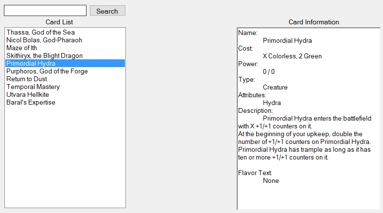

# Card List - (Windows Form UI)

WIP

Uses list of cards to populate the left `Card List` box, with a search function above it.

Depending one what card you select on the left, that card's information will be loaded onto the `Card Information` box on the right side.
